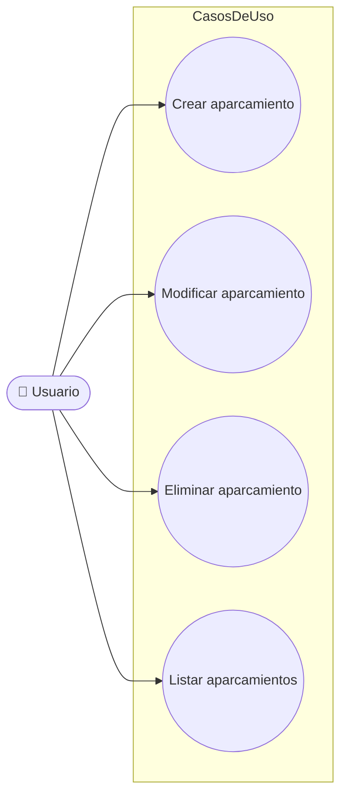

```mermaid
flowchart LR
  actorUser([👤 Usuario])

  subgraph CasosDeUso
    U1((Crear aparcamiento))
    U2((Modificar aparcamiento))
    U3((Eliminar aparcamiento))
    U4((Listar aparcamientos))

  end

  actorUser --> U1
  actorUser --> U2
  actorUser --> U3
  actorUser --> U4

```
