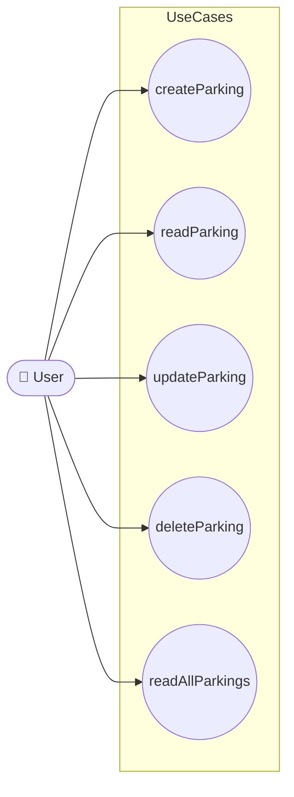

```mermaid
flowchart LR
  actorUser([👤 User])

  subgraph UseCases
    U1((createParking))
    U2((readParking))
    U3((updateParking))
    U4((deleteParking))
    U5((readAllParkings))
  end

  actorUser --> U1
  actorUser --> U2
  actorUser --> U3
  actorUser --> U4
  actorUser --> U5

```
