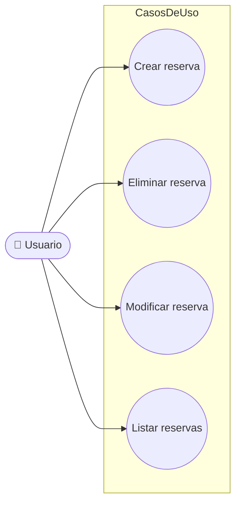

```mermaid
flowchart LR
  actorUser([👤 Usuario])

  subgraph CasosDeUso
    U1((Crear reserva))
    U2((Eliminar reserva))
    U3((Modificar reserva))
    U4((Listar reservas))

  end

  actorUser --> U1
  actorUser --> U2
  actorUser --> U3
  actorUser --> U4

```
