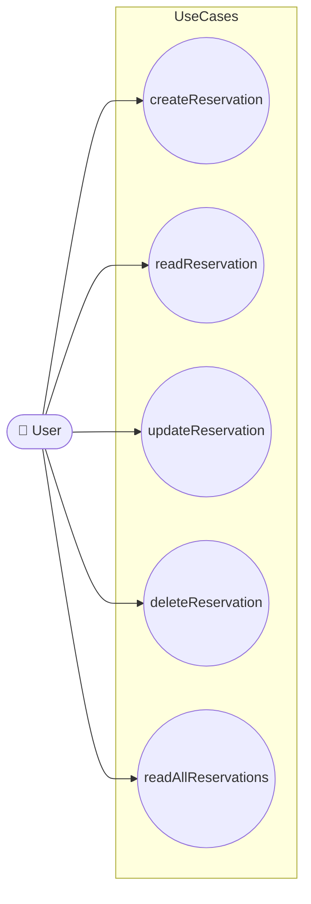

```mermaid
flowchart LR
  actorUser([👤 User])

  subgraph UseCases
    U1((createReservation))
    U2((readReservation))
    U3((updateReservation))
    U4((deleteReservation))
    U5((readAllReservations))

  end

  actorUser --> U1
  actorUser --> U2
  actorUser --> U3
  actorUser --> U4
  actorUser --> U5

```
