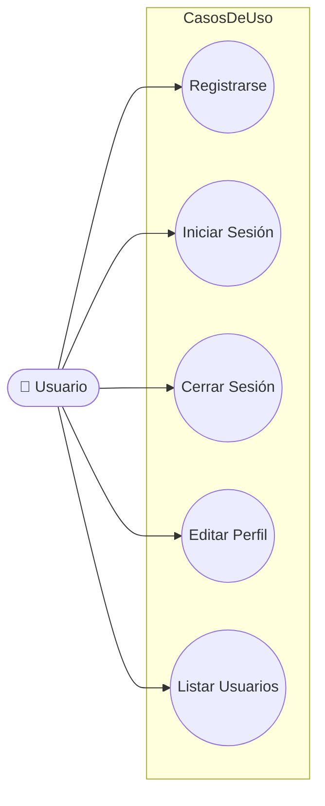

```mermaid
flowchart LR
  actorUser([👤 Usuario])

  subgraph CasosDeUso
    U1((Registrarse))
    U2((Iniciar Sesión))
    U3((Cerrar Sesión))
    U4((Editar Perfil))
    U5((Listar Usuarios))

  end

  actorUser --> U1
  actorUser --> U2
  actorUser --> U3
  actorUser --> U4
  actorUser --> U5

```
