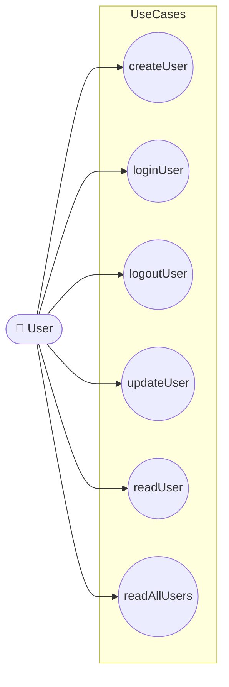

```mermaid
flowchart LR
  actorUser([👤 User])

  subgraph UseCases
    U1((createUser))
    U2((loginUser))
    U3((logoutUser))
    U4((updateUser))
    U5((readUser))
    U6((readAllUsers))
  end

  actorUser --> U1
  actorUser --> U2
  actorUser --> U3
  actorUser --> U4
  actorUser --> U5
  actorUser --> U6

```
