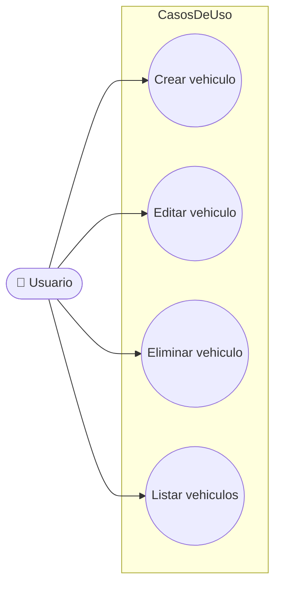

```mermaid
flowchart LR
  actorUser([👤 Usuario])

  subgraph CasosDeUso
    U1((Crear vehiculo))
    U2((Editar vehiculo))
    U3((Eliminar vehiculo))
    U4((Listar vehiculos))

  end

  actorUser --> U1
  actorUser --> U2
  actorUser --> U3
  actorUser --> U4

```
