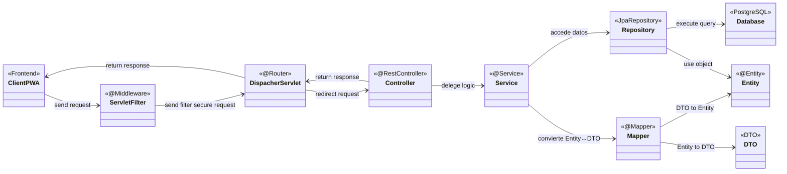

```mermaid
classDiagram
direction LR

%% ==== Entrada ====
class ClientPWA {
  <<Frontend>>
}

class ServletFilter {
  <<@Middleware>>
}

class DispacherServlet {
  <<@Router>>
}

class Controller {
  <<@RestController>>
}
ClientPWA --> ServletFilter : send request
ServletFilter --> DispacherServlet : send filter secure request
DispacherServlet --> Controller : redirect request
DispacherServlet --> ClientPWA : return response
Controller --> DispacherServlet : return response

class Service {
  <<@Service>>
}

class Repository {
  <<JpaRepository>>
}

class Entity {
  <<@Entity>>
}

class DTO {
  <<DTO>>
}

class Mapper {
  <<@Mapper>>
}

class Database {
  <<PostgreSQL>>
}

%% ==== Flujo ====
Mapper --> DTO : Entity to DTO
Mapper --> Entity : DTO to Entity
Controller --> Service : delege logic
Service --> Repository : accede datos
Repository --> Entity : use object
Repository --> Database : execute query
Service --> Mapper : convierte Entity↔DTO
```
