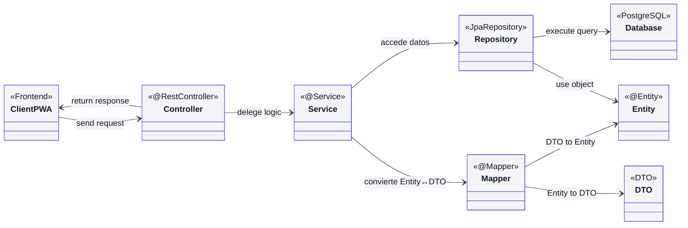

```mermaid
%%{init: {
  'theme': 'base',
  'themeVariables': {
    'background': '#ffffff',
    'primaryColor': '#f3f4f6',
    'primaryTextColor': '#111827',
    'primaryBorderColor': '#4f46e5',
    'lineColor': '#374151',
    'secondaryColor': '#e0e7ff',
    'tertiaryColor': '#ffffff'
  }
}}%%
classDiagram
direction LR

%% ==== Entrada ====
class ClientPWA {
  <<Frontend>>
}

class Controller {
  <<@RestController>>
}
ClientPWA --> Controller : send request
Controller --> ClientPWA : return response

class Service {
  <<@Service>>
}

class Repository {
  <<JpaRepository>>
}

class Entity {
  <<@Entity>>
}

class DTO {
  <<DTO>>
}

class Mapper {
  <<@Mapper>>
}

class Database {
  <<PostgreSQL>>
}

%% ==== Flujo ====
Mapper --> DTO : Entity to DTO
Mapper --> Entity : DTO to Entity
Controller --> Service : delege logic
Service --> Repository : accede datos
Repository --> Entity : use object
Repository --> Database : execute query
Service --> Mapper : convierte Entity↔DTO
```
