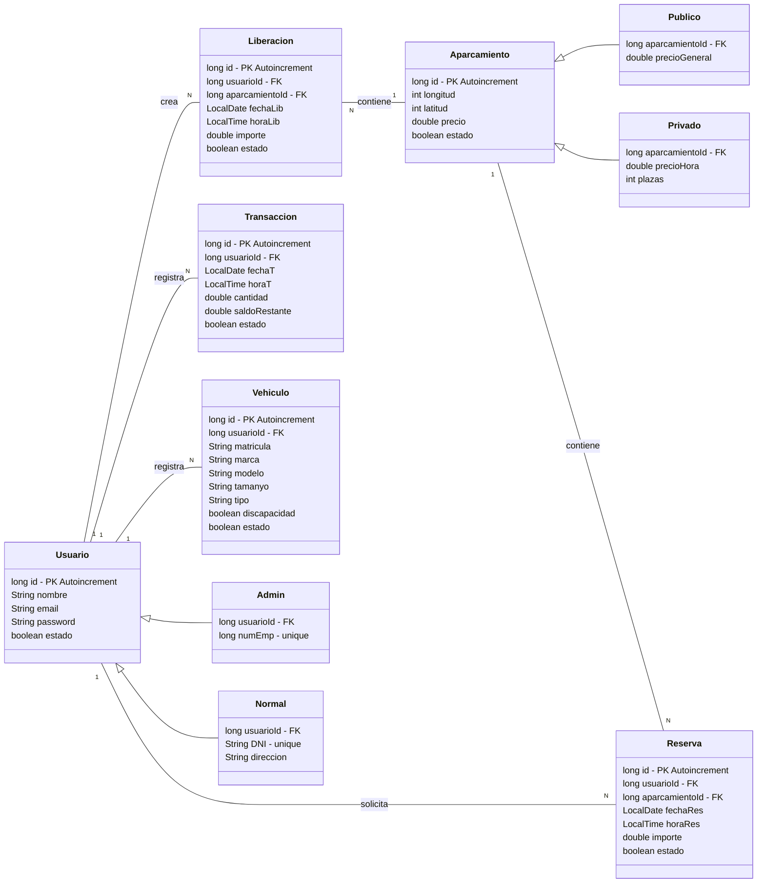

# Diagrama de Clases del Modelo del Dominio Completo

```mermaid
classDiagram
  direction LR

  class Usuario {
    long id - PK Autoincrement
    String nombre
    String email
    String password
    boolean estado
  }

  class Aparcamiento {
    long id - PK Autoincrement
    int longitud
    int latitud
    double precio
    boolean estado
  }


  class Reserva {
    long id - PK Autoincrement
    long usuarioId - FK
    long aparcamientoId - FK
    LocalDate fechaRes
    LocalTime horaRes
    double importe
    boolean estado
  }


  class Liberacion {
    long id - PK Autoincrement
    long usuarioId - FK
    long aparcamientoId - FK
    LocalDate fechaLib
    LocalTime horaLib
    double importe
    boolean estado
  }

  class Transaccion{
    long id - PK Autoincrement
    long usuarioId - FK
    LocalDate fechaT
    LocalTime horaT
    double cantidad
    double saldoRestante
    boolean estado
  }

  class Vehiculo{
    long id - PK Autoincrement
    long usuarioId - FK
    String matricula
    String marca
    String modelo
    String tamanyo
    String tipo
    boolean discapacidad
    boolean estado
  }

  class Admin{
    long usuarioId - FK
    long numEmp - unique
  }

  class Normal{
    long usuarioId - FK
    String DNI - unique
    String direccion
  }

  class Publico{
    long aparcamientoId - FK 
    double precioGeneral
  }

  class Privado{
    long aparcamientoId - FK 
    double precioHora
    int plazas
  }


%%Relaciones
  Usuario <|-- Admin
  Usuario <|-- Normal
  Aparcamiento <|-- Publico
  Aparcamiento <|-- Privado

  Usuario "1" -- "N" Liberacion : crea
  Reserva "N" -- "1" Usuario : solicita
  Aparcamiento "1" -- "N" Reserva : contiene
  Liberacion "N" -- "1" Aparcamiento : contiene
  Usuario "1" -- "N" Vehiculo : registra
  Usuario "1" -- "N" Transaccion : registra
```
