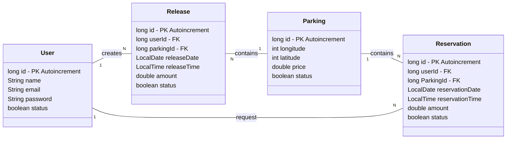

# Diagrama de Clases del Modelo del Dominio MVP

```mermaid
classDiagram
  direction LR

  class User {
    long id - PK Autoincrement
    String name
    String email
    String password
    boolean status
  }

  class Parking {
    long id - PK Autoincrement
    int longitude
    int latitude
    double price
    boolean status
  }


  class Reservation {
    long id - PK Autoincrement
    long userId - FK
    long ParkingId - FK
    LocalDate reservationDate
    LocalTime reservationTime
    double amount
    boolean status
  }


  class Release {
    long id - PK Autoincrement
    long userId - FK
    long parkingId - FK
    LocalDate releaseDate
    LocalTime releaseTime
    double amount
    boolean status
  }

  %% Relaciones
  User "1" -- "N" Release : creates
  Reservation "N" -- "1" User : request
  Parking "1" -- "N" Reservation : contains
  Release "N" -- "1" Parking : contains
```
