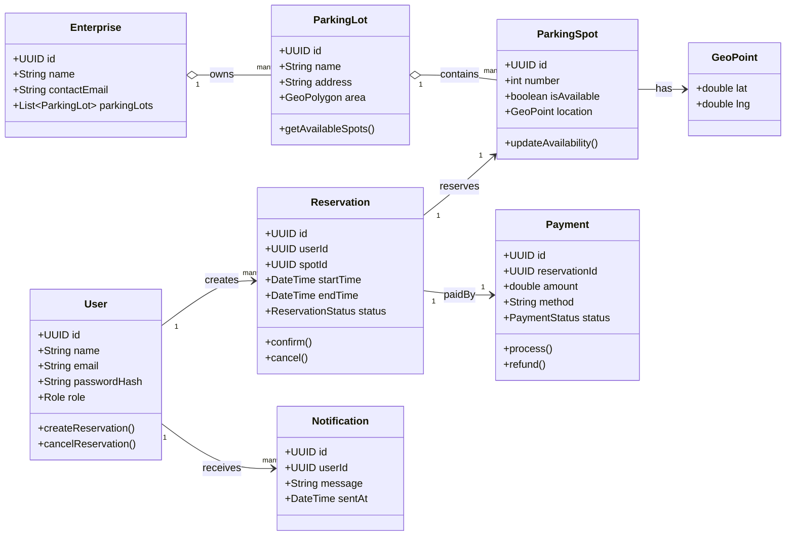

```mermaid
classDiagram
  direction LR

  class User {
    +UUID id
    +String name
    +String email
    +String passwordHash
    +Role role
    +createReservation()
    +cancelReservation()
  }

  class Enterprise {
    +UUID id
    +String name
    +String contactEmail
    +List~ParkingLot~ parkingLots
  }

  class ParkingLot {
    +UUID id
    +String name
    +String address
    +GeoPolygon area
    +getAvailableSpots()
  }

  class ParkingSpot {
    +UUID id
    +int number
    +boolean isAvailable
    +GeoPoint location
    +updateAvailability()
  }

  class Reservation {
    +UUID id
    +UUID userId
    +UUID spotId
    +DateTime startTime
    +DateTime endTime
    +ReservationStatus status
    +confirm()
    +cancel()
  }

  class Payment {
    +UUID id
    +UUID reservationId
    +double amount
    +String method
    +PaymentStatus status
    +process()
    +refund()
  }

  class Notification {
    +UUID id
    +UUID userId
    +String message
    +DateTime sentAt
  }

  class GeoPoint {
    +double lat
    +double lng
  }

  %% Relaciones
  User "1" --> "many" Reservation : creates
  Reservation "1" --> "1" ParkingSpot : reserves
  ParkingLot "1" o-- "many" ParkingSpot : contains
  Enterprise "1" o-- "many" ParkingLot : owns
  Reservation "1" --> "1" Payment : paidBy
  User "1" --> "many" Notification : receives
  ParkingSpot --> GeoPoint : has
```
