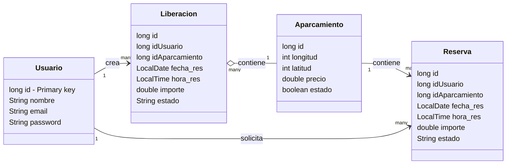

```mermaid
classDiagram
  direction LR

  class Usuario {
    long id - Primary key
    String nombre
    String email
    String password
  }

  class Aparcamiento {
    long id
    int longitud
    int latitud
    double precio
    boolean estado
  }


  class Reserva {
    long id
    long idUsuario
    long idAparcamiento
    LocalDate fecha_res
    LocalTime hora_res
    double importe
    String estado
  }


  class Liberacion {
    long id
    long idUsuario
    long idAparcamiento
    LocalDate fecha_res
    LocalTime hora_res
    double importe
    String estado
  }

  %% Relaciones
  Usuario "1" --> "many" Liberacion : crea
  Reserva "many" <-- "1" Usuario : solicita
  Aparcamiento "1" --> "many" Reserva : contiene
  Liberacion "many" o-- "1" Aparcamiento : contiene
```
